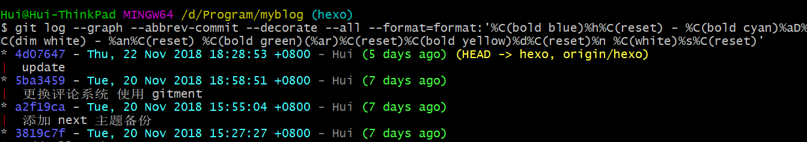

## 常用命令
> 全部命令参考 [Git命令图解](../images/git.png)

```bash
# 查看分支：
git branch -r # 查看所有远程分支
git branch -a # 查看本地及线上所有分支
git branch -vv # 本地分支关联到远程仓库的情况

# 新建分支：
git branch <new branch-name> # 新建分支
git checkout -b <new branch-name> # 新建并切换到该分支
git checkout -b <branch-name> origin/<branch-name> # 从远程分支中创建并切换到本地分支

# 回退分支：
git reset --hard HEAD~1 # 回退本地当前分支
    git push --force # 回退远程分支

# 删除分支：
git branch -d/-D <local-branch-name> # 删除一个本地分支
git push origin --delete <remote-branchname> # 删除远程分支
git push origin :<remote-branchname> # 删除远程分支
git branch --merged master | grep -v '^\*\|  master' | xargs -n 1 git branch -d # 删除已经合并到 master 的分支

# 代码暂存：
git stash # 代码暂存
git stash list # 查看暂存区列表
git stash apply <stash@{0}> # 恢复暂存区的代码（恢复完之后还保留在暂存区）
git stash pop # 恢复最后一个暂存内容，并删除该暂存
git stash clear # 清空暂存区

# 标签：
git tag -ln # 查看所有标签以及详细信息
git tag <version-number> # 新建本地标签
git tag -a <version-number> -m "v1.0 发布(描述)" <commit-id>  # 默认 tag 是打在最近的一次 commit 上，如果需要指定 commit 打 tag
git push origin <local-version-number> # 推送指定本地标签到远程
git push origin --tags  # 一次性推送所有标签，同步到远程仓库
git tag -d <tag-name> # 删除本地标签
git push origin :refs/tags/<tag-name> # 删除远程标签（需要先删除本地标签）
git checkout -b branch_name tag_name # 切换到某个标签

# git cherry-pick 向当前分支合并commit
git cherry-pick <commit-id> 单独合并一个提交
git cherry-pick -x <commit-id> 单独合并一个提交，并保留原来提交者信息
git cherry-pick <start-commit-id>..<end-commit-id> 把 start 到 end 之间的提交合并到当前分支 (不包含 start)
git cherry-pick <start-commit-id>^..<end-commit-id> 把 start 以及 end 之间的提交合并到当前分支 (包含 start)

# 其他操作：
git revert <commit-id> # 以新增一个 commit 的方式还原某一个 commit 的修改
git branch -m <new-branch-name> # 重命名本地分支
git bundle create <file> <branch-name> # 把某一个分支到导出成一个文件
git clean -X -f # 清除Ignore中记录的文件
git show <branch-name>:<file-name> # 展示某一分支下的某个文件修改
git clone -b <branch-name> --single-branch https://github.com/user/repo.git # 仅Clone下来指定的单一分支
git config core.fileMode false # 忽略文件的权限变化
git for-each-ref --sort=-committerdate --format='%(refname:short)' refs/heads/ # 以最后提交的顺序列出所有Git分支
git remote set-url origin <URL> # 修改远程仓库的URL
```

## Git 监听大小写设置
Mac 开发默认大小写不敏感所以可能会遇到本地环境没问题，上线报错的问题
解决： `git config core.ignorecase false`

## Git硬回退补救方案
> `git reflog` 查看Git所有分支的所有操作(包含已经删除的记录)
> `git cherry-pick <commit id>` 向当前分支单独合并一个提交

假定当前场景为： 在提交了 1，2，3，4，5 等多个 **feature commit**之后，然后执行了 `git reset --hard xxx1` 代码硬回退到第一次提交， 然后又提交了第 6 个 **feature commit**， 现在想要恢复 1，2，3，4，5，6 等 feature commit 提交
恢复步骤
1. 执行 `git reflog` 查看操作记录

```diff 
xxx7 HEAD@{0} commit: feature-6
xxx6 HEAD@{1} commit: reset moving to xxx1
-xxx5 HEAD@{2} commit: feature-5  ▔▔|
-xxx4 HEAD@{3} commit: feature-4    |=> 硬回退部分
-xxx3 HEAD@{4} commit: feature-3    |
-xxx2 HEAD@{5} commit: feature-2  __|
xxx1 HEAD@{6} commit: feature-1
```

记录硬回退之前的一次提交(xxx5) 和 后面需要保存的提交(xxx6)
2. 执行 `git reset --hard xxx5` 恢复代码到硬回退之前的这次提交中
3. 合并需要保存的提交 `git cherry-pick xxx6` 

## 技巧
 由于在项目中经常要用到 `git log` 来查看提交历史，分享一个不错的 `git log` 的配置
```bash 
git log --graph --abbrev-commit --decorate --all --format=format:'%C(bold blue)%h%C(reset) - %C(bold cyan)%aD%C(dim white) - %an%C(reset) %C(bold green)(%ar)%C(reset)%C(bold yellow)%d%C(reset)%n %C(white)%s%C(reset)'
```

效果如图：


添加到 bash alias :
```bash 
alias gitlog="git log --graph --abbrev-commit --decorate --all --format=format:'%C(bold blue)%h%C(reset) - %C(bold cyan)%aD%C(dim white) - %an%C(reset) %C(bold green)(%ar)%C(reset)%C(bold yellow)%d%C(reset)%n %C(white)%s%C(reset)'"
```

> 分享来自 [分享一个自定义的 git log 配置](https://www.codecasts.com/blog/post/a-beautiful-git-log-format)
