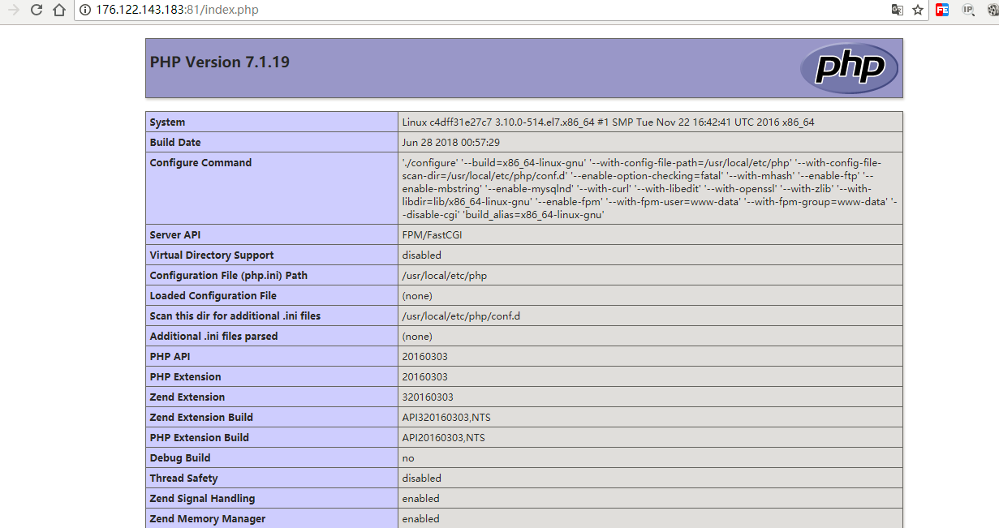
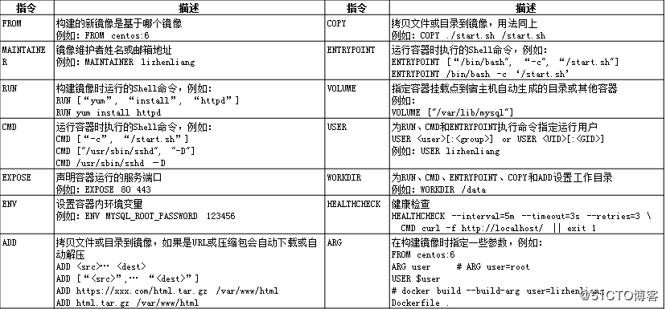

# Docker学习笔记

## 安装 Docker 

> - 版本：社区版（Docker Community Edition）
> - 介绍：[Docker在PHP项目开发中的应用](https://avnpc.com/pages/build-php-develop-env-by-docker)
> - 相关资料：[Docker-从入门到实践](https://yeasy.gitbooks.io/docker_practice/content/)
> - 如果之前有安装过的旧版本 先卸载 `yum remove docker  docker-common docker-selinux docker-engine`
>> **因为我服务器中已安装了一套运行环境为避免冲突，相关应用会修改相应的端口**

- 添加软件源:

```bash
yum-config-manager --add-repo https://download.docker.com/linux/centos/docker-ce.repo

# 如果没有 yum-config-manager 命令则执行下面
yum install -y yum-utils device-mapper-persistent-data lvm2
```

- 查看软件仓库中所有的 `Docker` 版本

```bash 
yum list docker-ce --showduplicates | sort -r
```

- 安装最新版本 [ 指定版本 ]

```bash
# [docker-ce] 替换指定版本
sudo yum install [docker-ce]
```
- 加入 `Docker` 到开机启动

```bash 
systemctl enable docker
```

- 启动 `Docker` 

```bash 
systemctl start docker
```
- 查看 `Docker` 状态

```bash 
systemctl status docker
```

- 加速 `Docker` 

```bash 
curl -sSL https://get.daocloud.io/daotools/set_mirror.sh | sh -s http://9d4cd35f.m.daocloud.io

# 修改完成后会提示重启
systemctl restart docker
```

## 安装 docker-compose 

> [docker-compose介绍](http://dockone.io/article/34)

```bash 
pip install docker-compose
```

## 『 docker permission denied 』解决

> Docker 守候进程绑定的是一个 **Unix Socket** ， 而不是 TCP 端口 ， 这个套接字默认是 root 用户， 其他是用户可以使用 `sudo` 命令来访问这个套接字文件 ，  所以 Docker 服务进程都是以 root 帐号的身份运行的
为了避免每次运行 Docker 命令的时候都要输入 sudo ， 可以创建一个 Docker 用户组 ， 并添加相应用户到这个组里面即可
>> **注** ： 该用户组内的用户等同于 root 帐号

查看用户组中是否存在 Docker 组
```bash
sudo cat /etc/group | grep docker
```
如果不存在则创建 docker 组
```bash 
sudo groupadd -g [gid] docker 
```
添加用户
```bash 
sudo usermod -aG docker [user]
```
重启 docker 
```bash 
sudo systemctl restart docker
```

## 在 Docker 上构建 LNMP 环境
### MySQL

```bash 
# 获取 mysql5.6 版本的docker镜像
docker pull mysql:5.6
# 创建mysql容器
docker run -d -p 3307:3306 -e MYSQL_ROOT_PASSWORD=admin --name mysql5.6 mysql:5.6
# -d：让容器在后台运行
# -p：添加主机到容器的端口映射
# -e：设置环境变量，这里是设置MySQL的root账户的初始密码 （必选）
# -name：容器的名字，必须唯一
# 当前配置的 MySQL5.6  账号是 root ,  密码是 admin
```

### PHP-FPM

```bash 
# 拉取php-fpm 
docker pull php:7.1-fpm
# 创建 php-fpm 容器
docker run -d -v /www:/var/www/html -p 9001:9000 --link mysql5.6:mysql --name phpfpm7.1 php:7.1-fpm 
# -v 目录映射，把主机的 /www 目录映射到容器中的 /var/www/html 目录
# –link 与另外一个容器建立起联系，这样我们就可以在当前容器中去使用另一个容器里的服务。
#      或者使用 ip 去访问其它容器的服务
```
> **在PHP-FPM容器中**  安装PHP扩展使用命令 `docker-php-ext-install pdo_mysql`

### 在 phpfpm 容器中安装 composer

```bash 
# 下载
php -r "copy('https://getcomposer.org/installer', 'composer-setup.php');"
php composer-setup.php
php -r "unlink('composer-setup.php');"
# 全局配置
mv composer.phar /usr/local/bin/composer
```

### Nginx

```bash
# 拉取 Nginx 镜像
docker pull nginx:1.14.0
# 创建 Nginx 容器
docker run -d -p 81:80 -v /www:/var/www/html --link phpfpm7.1:phpfpm --name nginx nginx:1.14.0
```
> **在Nginx容器中** 修改nginx配置文件

```bash
location ~ \.php$ {
    root           /var/www/html;
    fastcgi_index  index.php;
    fastcgi_pass   phpfpm:9001;
    fastcgi_param  SCRIPT_FILENAME $document_root$fastcdi_script_name;
    include        fastcgi_params;
}
```

### 测试


## 使用 DockerFile 构建环境
> 推荐阅读：[如何编写最佳的Dockerfile](http://www.phpchina.com/portal.php?mod=view&aid=41111)

### 介绍

`DockerFile` 是 `Docker` 用来构建镜像的一个文件，包含自定义的指令，类似于shell脚本，把一系列的指令集和放在一个 .sh 文件中去执行
**DockerFile**分为四部分组成：**基础镜像信**、**维护者信息**、**镜像操作指令** 和 **容器启动时执行指令**。例如：

```bash
# 第一行必须指令基于的基础镜像
From ubutu

# 维护者信息
MAINTAINER docker_user  docker_user@mail.com

# 镜像的操作指令
apt/sourcelist.list

RUN apt-get update && apt-get install -y ngnix 
RUN echo "\ndaemon off;">>/etc/ngnix/nignix.conf

# 容器启动时执行指令
CMD /usr/sbin/ngnix
```



### 使用 DockerFile 构建自己的 PHP 开发环境
> 参考 https://github.com/laradock/laradock

目录结构：

```bash
 DockerFiles
|--MySQL
|  |--DockerFile
|--PHP-FPM
|  |--DockerFile
|  |--xdebug.ini : https://raw.githubusercontent.com/Laradock/laradock/master/php-fpm/xdebug.ini
|  |--opcache.ini : https://github.com/Laradock/laradock/blob/master/php-fpm/opcache.ini
|--Nginx
|  |--DcokerFile
|  |--nginx.conf
|--Redis
|  |--DcokerFile
|--docker-compose.yml 
```
#### MySQL DockerFile：

```bash
FROM mysql:latest

MAINTAINER learner.hui "learner.hui@gmail.com"

# Set Timezone
ENV TZ=Asia/Shanghai
RUN ln -snf /usr/share/zoneinfo/$TZ /etc/localtime && echo $TZ > /etc/timezone && chown -R mysql:root /var/lib/mysql/
```

#### PHP-FPM DockerFile：

```bash
FROM php:7.2-fpm
MAINTAINER learner.hui "learner.hui@gmail.com"

# 设置时区
ENV TZ=Asia/Shanghai
RUN ln -snf /usr/share/zoneinfo/$TZ /etc/localtime && echo $TZ > /etc/timezone

# 更新安装依赖包和PHP核心拓展
RUN apt-get update && apt-get install -y \
        git \
        libfreetype6-dev \
        libjpeg62-turbo-dev \
        libpng-dev \
    && docker-php-ext-configure gd --with-freetype-dir=/usr/include/ --with-jpeg-dir=/usr/include/ \
    && docker-php-ext-install -j$(nproc) gd \
        && docker-php-ext-install zip \
        && docker-php-ext-install pdo_mysql \
        && docker-php-ext-install opcache \
        && docker-php-ext-install mysqli \
        && rm -r /var/lib/apt/lists/*

# 安装 Xdebug
ARG INSTALL_XDEBUG=true

RUN if [ ${INSTALL_XDEBUG} = true ]; then \
  # Install the xdebug extension
  if [ $(php -r "echo PHP_MAJOR_VERSION;") = "5" ]; then \
    pecl install xdebug-2.5.5; \
  else \
    pecl install xdebug; \
  fi && \
  docker-php-ext-enable xdebug \
;fi

# Copy xdebug configuration for remote debugging
COPY ./xdebug.ini /usr/local/etc/php/conf.d/xdebug.ini

RUN sed -i "s/xdebug.remote_autostart=0/xdebug.remote_autostart=1/" /usr/local/etc/php/conf.d/xdebug.ini && \
    sed -i "s/xdebug.remote_enable=0/xdebug.remote_enable=1/" /usr/local/etc/php/conf.d/xdebug.ini && \
    sed -i "s/xdebug.cli_color=0/xdebug.cli_color=1/" /usr/local/etc/php/conf.d/xdebug.ini

# 安装 Redis
printf "\n" | pecl install -o -f redis \
    &&  rm -rf /tmp/pear \
    &&  docker-php-ext-enable redis \

# 安装 Swoole
ARG INSTALL_SWOOLE=false
RUN if [ ${INSTALL_SWOOLE} = true ]; then \
    # Install Php Swoole Extension
    if [ $(php -r "echo PHP_MAJOR_VERSION;") = "5" ]; then \
      pecl install swoole-2.0.11; \
    else \
      if [ $(php -r "echo PHP_MINOR_VERSION;") = "0" ]; then \
        pecl install swoole-2.2.0; \
      else \
        pecl install swoole; \
      fi \
    fi && \
    docker-php-ext-enable swoole \
;fi

# 安装 MongoDB
ARG INSTALL_MONGO=false
RUN if [ ${INSTALL_MONGO} = true ]; then \
    # Install the mongodb extension
    if [ $(php -r "echo PHP_MAJOR_VERSION;") = "5" ]; then \
      pecl install mongo && \
      docker-php-ext-enable mongo \
    ;fi && \
    pecl install mongodb && \
    docker-php-ext-enable mongodb \
;fi

# Opcache
docker-php-ext-install opcache \
COPY ./opcache.ini /usr/local/etc/php/conf.d/opcache.ini

# 安装 Composer
ENV COMPOSER_HOME /root/composer
RUN curl -sS https://getcomposer.org/installer | php -- --install-dir=/usr/local/bin --filename=composer
ENV PATH $COMPOSER_HOME/vendor/bin:$PATH

USER root

# Clean up
RUN apt-get clean && \
    rm -rf /var/lib/apt/lists/* /tmp/* /var/tmp/* && \
    rm /var/log/lastlog /var/log/faillog

RUN usermod -u 1000 www-data
WORKDIR /var/www
```

#### Nginx DockerFile：
```bash
FROM nginx:alpine
MAINTAINER learner.hui "learner.hui@gmail.com"
COPY nginx.conf /etc/nginx/
sed -i 's/dl-cdn.alpinelinux.org/mirrors.aliyun.com/' /etc/apk/repositories \
RUN apk update \
    && apk upgrade \
    && apk add --no-cache openssl \
    && apk add --no-cache bash \
    && adduser -D -H -u 1000 -s /bin/bash www-data
ARG PHP_UPSTREAM_CONTAINER=php-fpm
ARG PHP_UPSTREAM_PORT=9000
```

#### Redis DockerFile
```bash
FROM redis:latest
MAINTAINER learner.hui "learner.hui@gmail.com"
# set timezome
ENV TZ=Asia/Shanghai
RUN ln -snf /usr/share/zoneinfo/$TZ /etc/localtime && echo $TZ > /etc/timezone
```

#### docker-compose.yml
```bash
version: '1.0'
services:
  php-fpm:
    build: ./php/
    ports:
      - "9000:9000"
    links:
      - mysql-db:mysql-db
      - redis-db:redis-db
    volumes:
      - ../www:/data/www:rw
      - ./php/php-dev.ini:/usr/local/etc/php/php.ini:ro
      - ./php/php-fpm.conf:/usr/local/etc/php-fpm.conf:ro
      - ../logs/php-fpm:/var/log/php-fpm:rw
    restart: always
    command: php-fpm

  nginx:
    build: ./nginx
    depends_on:
      - php-fpm
    links:
      - php-fpm:php-fpm
    volumes:
      - ../www:/data/www:rw
      - ./nginx/conf.d:/etc/nginx/conf.d:ro
      - ./nginx/nginx.conf:/etc/nginx/nginx.conf:ro
      - ../logs/nginx:/var/log/nginx
    ports:
      - "80:80"
      - "443:443"
    restart: always
    command: nginx -g 'daemon off;'

  mysql-db:
      build: ./mysql
      ports:
        - "3306:3306"
      volumes:
        - ../data/mysql:/var/lib/mysql:rw
        - ../logs/mysql:/var/lib/mysql-logs:rw
        - ./mysql/conf.d:/etc/mysql/conf.d:ro
      environment:
        MYSQL_ROOT_PASSWORD: admin
        MYSQL_DATABASE: database_test
        MYSQL_USER: hui
        MYSQL_PASSWORD: learner
      restart: always
      command: "--character-set-server=utf8"

  redis-db:
      build: ./redis
      ports:
        - "6379:6379"
      volumes:
        - ../data/redis:/data
      restart: always
```

## Docker 相关命令
1. `sudo docker images`  查看本地**docker**镜像文件
2. `sudo docker ps -a`   查看所有容器的进程情况
3. `sudo docker exec -ti docker_names /bin/bash` 进入docker容器中
> -t 在容器里生产一个伪终端
> -i 对容器内的标准输入 (STDIN) 进行交互
4.  `sudo docker stop name`  停止一个运行中的容器
    `sudo docker rm name`    删除本地一个容器 （需要该容器处于未运行状态）
    `sudo docker rmi image`  删除本地一个镜像文件
5. `sudo docker search <name>` 搜索某个镜像
6. `sudo docker pull [options] <name[:tag]>` 拉取/下载某个镜像
7. `sudo docker exec [OPTIONS] <container> <command> [ARG...]` 在运行的容器中执行命令
8. 查看 phpfpm 容器的 IP 地址:

```bash
sudo docker inspect --format '{{ .NetworkSettings.IPAddress }}' [phpfpm]
# 或者
sudo docker inspect [phpfpm] | grep IPAddress
```