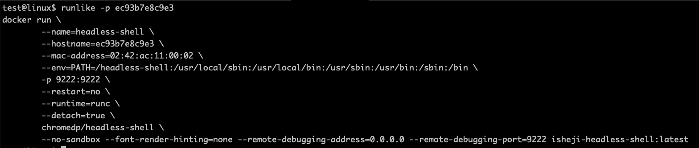

# Docker 工具

## runlike 和 whaler

> 转自公众号： [云原生生态圈(99%的人没使用过它俩，Docker最佳实践+2)](https://mp.weixin.qq.com/s/E6tefqdNFxUpL-93UDmRqA)


最近发现两个非常好用的工具，一个是 [runlike](https://github.com/lavie/runlike)，一个是 [whaler](https://github.com/P3GLEG/Whaler)

- runlike：通过容器打印出容器的启动命令
- whaler：通过镜像导出 dockerfile

### 找回Docker容器运行的命令

> 平时可能因为测试或者一些规范的操作方式导致启动一个容器，忘记了这个容器的启动命令是什么了，又需要找回来在别的机器上创建的时候，就很麻烦，可能很多人会想到通过docker inspect分析输出的json文件中的volume、ports、Env等


这个命令应该是很熟悉的，查看容器的基本信息。


虽然这样也能找到运行容器的命令，但是依旧还需要时间去整理，因此这里分享一个可以直接打印运行命令的工具 runlike ，在 runlike 传递一个容器名称，就会直接打印出该容器的运行命令。 runlike 使用起来非常方便，可以直接通过 pip 安装，也可以通过容器方式免安装使用:

```bash
# 通过 pip 安装
pip install runlike
# 通过 docker 安装
alias runlike="docker run --rm -v /var/run/docker.sock:/var/run/docker.sock assaflavie/runlike"
```

下面还是通过上面那个容器测试一下是否可以:



这样使用起来就方便很多了。关于 runlike 一些其他的选项，可以直接通过--help学习。

### 从镜像导出Dockerfile

> 平时可能会构建很多不同的镜像，比如维护一些基础 Docker 镜像、想查看一些公开仓库的Docker镜像是怎么构建的，或因为长时间不维护找不到当时构建镜像的 Dockerfile ，或者因为网络无法查看时，能从镜像导出 Dockerfile 就显得很重要，这里可以通过 whaler 来快速的导出. 这里我们依旧不安装，通过容器化的方式使用 dfimage 命令，便于使用，我们将该命令写成命令别名

```bash
# alias export docker image to dockerfile
alias whaler="docker run -t --rm -v /var/run/docker.sock:/var/run/docker.sock:ro pegleg/whaler"
```

测试 hello-world


