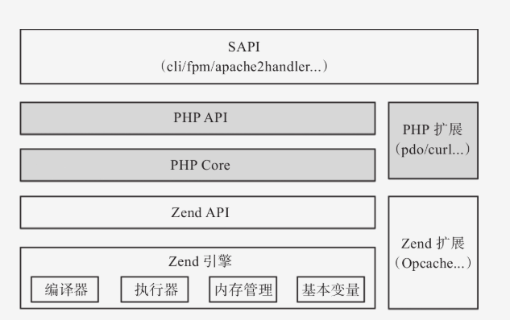

## PHP7底层运行机制
参考链接：
- [浅析 PHP7 底层运行机制](https://learnku.com/articles/32343)
- [【PHP7源码分析】PHP7语言的执行原理](https://zhuanlan.zhihu.com/p/42215849)

 运行过程：
 PHP 代码 => Token标识 => 抽象语法树(AST) => Opcodes => 执行

1. 源代码通过词法分析得到 **Token**
> **Token** 是 PHP 代码被切割成的有意义的标识。PHP7 一共有 137 种 Token，在 zend_language_parser.h 文件中做了定义。
2. 基于语法分析器将 Token 转换成抽象语法树（**AST**）
> Token 就是一个个的词块，但是单独的词块不能表达完整的语义，还需要借助一定的规则进行组织串联。所以就需要语法分析器根据语法匹配 Token，将 Token 进行串联。语法分析器串联完 Token 后的产物就是抽象语法树（AST，Abstract Syntax Tree）
> AST 是 PHP7 版本的新特性，之前版本的 PHP 代码的执行过程中是没有生成 AST 这一步的。它的作用主要是实现了 PHP 编译器和解释器的解耦，提升了可维护性
3. 将语法树转换成 **Opcode**
> 需要将语法树转换成 **Opcode**， 才能被引擎直接执行
4. 执行 Opcodes
> opcodes 是 opcode 的集合形式，是 PHP 执行过程中的中间代码。PHP 工程优化措施中有一个比较常见的 “开启 opcache”，指的技术这里将 opcodes 进行缓存。通过省去从源码到 opcode 的阶段，引擎直接执行缓存好的 opacode，以提升性能

### PHP7 内核架构


#### Zend 引擎
词法 / 语法分析、AST 编译和 opcodes 的执行均在 Zend 引擎中实现。此外，PHP 的变量设计、内存管理、进程管理等也在引擎层实现。

#### PHP层
zend 引擎为 PHP 提供基础能力，而来自外部的交互则需要通过 PHP 层来处理。

#### SAPI
server API 的缩写，其中包含了场景的 cli SAPI 和 fpm SAPI。只要遵守定义好的 SAPI 协议，外部模块便可与 PHP 完成交互。

#### 扩展部分
依据 zend 引擎提供的核心能力和接口规范，可以进行开发扩展

## PHP 运行的生命周期
- 模块初始化阶段 (Module init)：即调用每个拓展源码中的的 PHP_MINIT_FUNCTION 中的方法初始化模块，进行一些模块所需变量的申请，内存分配等。
- 请求初始化阶段 (Request init)：即接受到客户端的请求后调用每个拓展的 PHP_RINIT_FUNCTION 中的方法，初始化 PHP 脚本的执行环境。
- 执行该 PHP 脚本。
- 请求结束 (Request Shutdown)：这时候调用每个拓展的 PHP_RSHUTDOWN_FUNCTION 方法清理请求现场，并且 ZE 开始回收变量和内存
- 关闭模块 (Module shutdown)：Web 服务器退出或者命令行脚本执行完毕退出会调用拓展源码中的 PHP_MSHUTDOWN_FUNCTION 方法

## Laravel
### Laravel 的生命周期
1. 加载项目依赖，注册加载 composer 自动生成的 class loader，也就是加载初始化第三方依赖。
2. 创建应用实例，生成容器 Container，并向容器注册核心组件，是从 bootstrap/app.php 脚本获取 Laravel 应用实例，并且绑定内核服务容器，它是 HTTP 请求的运行环境的不同，将请求发送至相应的内核： HTTP 内核 或 Console 内核
    -  创建服务容器：从 bootstrap/app.php 文件中取得 Laravel 应用实例 $app (服务容器)
    -  创建 HTTP / Console 内核：传入的请求会被发送给 HTTP 内核或者 console 内核进行处理
    -  载入服务提供者至容器：
       在内核引导启动的过程中最重要的动作之一就是载入服务提供者到你的应用，服务提供者负责引导启动框架的全部各种组件，例如数据库、队列、验证器以及路由组件。
3. 接收请求并响应，请求被发送到 HTTP 内核或 Console 内核，这取决于进入应用的请求类型。HTTP 内核继承自 Illuminate\Foundation\Http\Kernel 类，该类定义了一个 bootstrappers 数组，这个数组中的类在请求被执行前运行，这些 bootstrappers 配置了错误处理、日志、检测应用环境以及其它在请求被处理前需要执行的任务。HTTP 内核还定义了一系列所有请求在处理前需要经过的 HTTP 中间件，这些中间件处理 HTTP 会话的读写、判断应用是否处于维护模式、验证 CSRF 令牌等等。
4. 发送请求，在 Laravel 基础的服务启动之后，把请求传递给路由了。路由器将会分发请求到路由或控制器，同时运行所有路由指定的中间件。传递给路由是通过 Pipeline（管道）来传递的，在传递给路由之前所有请求都要经过 app\Http\Kernel.php 中的 $middleware 数组，也就是中间件，默认只有一个全局中间件，用来检测你的网站是否暂时关闭。所有请求都要经过，你也可以添加自己的全局中间件。然后遍历所有注册的路由，找到最先符合的第一个路由，经过它的路由中间件，进入到控制器或者闭包函数，执行你的具体逻辑代码，把那些不符合或者恶意的的请求已被 Laravel 隔离在外。

### 什么是服务提供者
服务提供者是所有 Laravel 应用程序引导启动的中心, Laravel 的核心服务器、注册服务容器绑定、事件监听、中间件、路由注册以及我们的应用程序都是由服务提供者引导启动的

### 什么是 Ioc 容器  (控制反转和依赖注入)
IoC（Inversion of Control）译为 「控制反转」，也被叫做「依赖注入」(DI)。

1. 什么是「控制反转」？
> 对象 A 功能依赖于对象 B，但是控制权由对象 A 来控制，控制权被颠倒，所以叫做「控制反转」，
2. 而「依赖注入」是实现 IoC 的方法，
> 就是由 IoC 容器在运行期间，动态地将某种依赖关系注入到对象之中。

**其作用简单来讲就是利用依赖关系注入的方式，把复杂的应用程序分解为互相合作的对象，从而降低解决问题的复杂度，实现应用程序代码的低耦合、高扩展。**

Laravel 中的服务容器是用于管理类的依赖和执行依赖注入的工具。

## 接口与抽象类的区别
1. 接口
  1. 对接口的使用是通过关键字implements
  2. 接口不能定义成员变量（包括类静态变量），能定义常量
  3. 子类必须实现接口定义的所有方法
  4. 接口只能定义不能实现该方法
  5. 接口没有构造函数
  6. 接口中的方法和实现它的类默认都是public类型的
2. 抽象类
  1. 对抽象类的使用是通过关键字extends
  2. 不能被实例化，可以定义子类必须实现的方法
  3. 子类必须定义父类中的所有抽象方法，这些方法的访问控制必须和父类中一样（或者更为宽松）
  4. 如一个类中有一个抽象方法，则该类必须定义为抽象类
  5. 抽象类可以有构造函数
  6. 抽象类中的方法可以使用private,protected,public来修饰。
  7. 一个类可以同时实现多个接口，但一个类只能继承于一个抽象类。

## OOP 
>oop 是面向对象编程，面向对象编程是一种计算机编程架构，OOP 的一条基本原则是程序是由单个能够起到子程序作用的单元或对象组合而成。

1. 封装性：也称为信息隐藏，就是将一个类的使用和实现分开，只保留部分接口和方法与外部联系，或者说只公开了一些供开发人员使用的方法。于是开发人员只 需要关注这个类如何使用，而不用去关心其具体的实现过程，这样就能实现 MVC 分工合作，也能有效避免程序间相互依赖，实现代码模块间松藕合。
2. 继承性：就是子类自动继承其父级类中的属性和方法，并可以添加新的属性和方法或者对部分属性和方法进行重写。继承增加了代码的可重用性。PHP 只支持单继承，也
就是说一个子类只能有一个父类。
3. 多态性：子类继承了来自父级类中的属性和方法，并对其中部分方法进行重写。于是多个子类中虽然都具有同一个方法，但是这些子类实例化的对象调用这些相同的方法后却可以获得完全不同的结果，这种技术就是多态性。多态性增强了软件的灵活性。

## 魔术方法
```php
__autoload() 类文件自动加载函数
__construct() 构造函数，PHP 将在对象创建时调用这个方法
__destruct()  析构函数，PHP 将在对象被销毁前（即从内存中清除前）调用这个方法
__call() 当所调用的成员方法不存在（或者没有权限）该类时调用，用于对错误后做一些操作或者提示信息
__clone() 该函数在对象克隆时自动调用，其作用是对克隆的副本做一些初始化操作
__get() 当所对象所调用的成员属性未声明或者级别为 private 或者 protected 等时，我们可以在这个函数里进行自己的一些操作
__set() 当所对未声明或者级别为 private 或者 protected 等进行赋值时调用此函数，我们可以在这个函数里进行自己的一些操作
__isset() 当对一个未声明或者访问级别受限的成员属性调用 isset 函数时调用此函数，共用户做一些操作
__unset() 当对一个未声明或者访问级别受限的成员属性调用 unset 函数时调用此函数，共用户做一些操作
__toString() 函数 该函数在将对象引用作为字符串操作时自动调用，返回一个字符串
__sleep() 函数 该函数是在序列化时自动调用的，序列化这里可以理解成将信息写如文件中更长久保存
__wakeup() 函数 该魔术方法在反序列化的时候自动调用，为反序列化生成的对象做一些初始化操作
__invoke() 函数，当尝试以调用函数的方式调用一个对象时，invoke 方法会被自动调用。
_callStatic() 函数，它的工作方式类似于 call () 魔术方法，callStatic() 是为了处理静态方法调用，
```

## 超全局变量
```php
$GLOBALS 是 PHP 的一个超级全局变量组，在一个 PHP 脚本的全部作用域中都可以访问。是一个包含了全部变量的全局组合数组。变量的名字就是数组的键。
$_SERVER 是一个包含了诸如头信息 (header)、路径 (path)、以及脚本位置 (script locations) 等等信息的数组。这个数组中的项目由 Web 服务器创建。不能保证每个服务器都提供全部项目；服务器可能会忽略一些，或者提供一些没有在这里列举出来的项目。
$_REQUEST 用于收集 HTML 表单提交的数据。
$_POST 被广泛应用于收集表单数据，在 HTML form 标签的指定该属性："method"="post"。
$_GET 同样被广泛应用于收集表单数据，在 HTML form 标签的指定该属性："method"="get"。
$_COOKIE 经由 HTTP Cookies 方法提交至脚本的变量
$_SESSION 当前注册给脚本会话的变量。类似于旧数组 $HTTP_SESSION_VARS 数组。
$_FILES 经由 HTTP POST 文件上传而提交至脚本的变量。类似于旧数组 $HTTP_POST_FILES 数组。
$_ENV 执行环境提交至脚本的变量。类似于旧数组 $HTTP_ENV_VARS 数组。

```